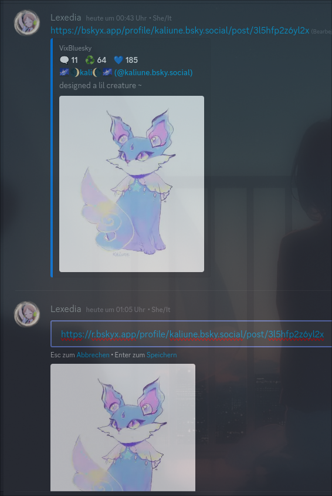

# girlcockbsky Fork of VixBluesky 🛠️ (Inspired by [FixTweet](https://github.com/FixTweet/FixTweet))

> [!IMPORTANT]
> This is a fork of VixBluesky which is a fork of [FixBluesky](https://github.com/ThornbushHQ/FixBluesky) by [@ItsRauf](https://www.github.com/ItsRauf).
> All credits go to them for the original idea and implementation.

Converted to nodejs cause serverless design's proprietary-ness annoys me and i wanted to make a funny joke after seeing girlcockx for twitter.

Embed Bluesky links in Discord.

## How To Use?

#### Simply append `girlcock` at the front of `bsky.app`.

## Direct Links

You want to link to a media directly? You can prepend `r.` to the URL to get a direct link.

## Authors

- [@ItsRauf](https://www.github.com/ItsRauf) - Original author
- [@Lexedia](https://www.github.com/Rapougnac) - Also Original author
